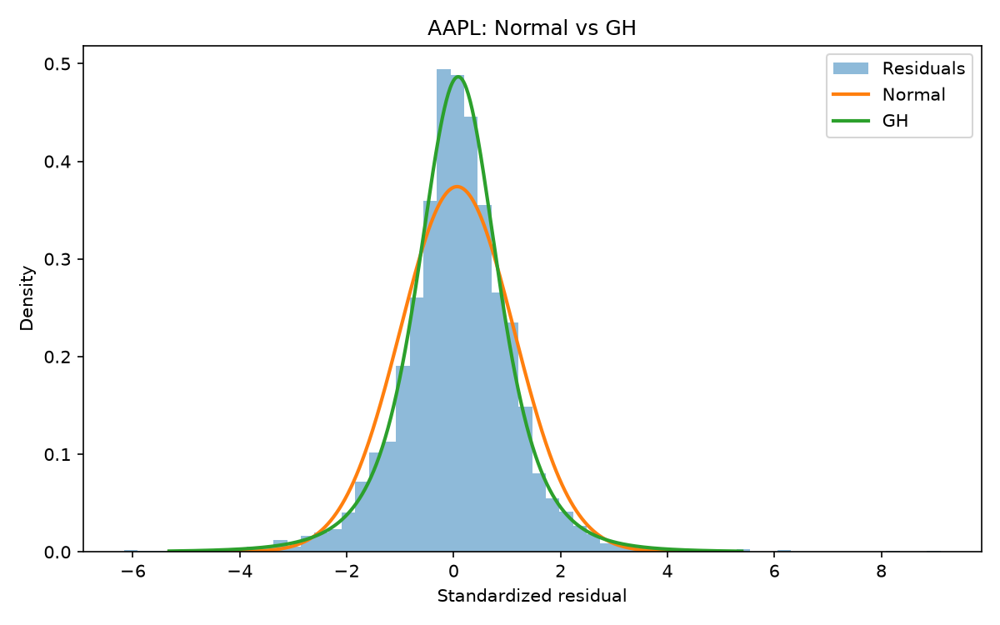
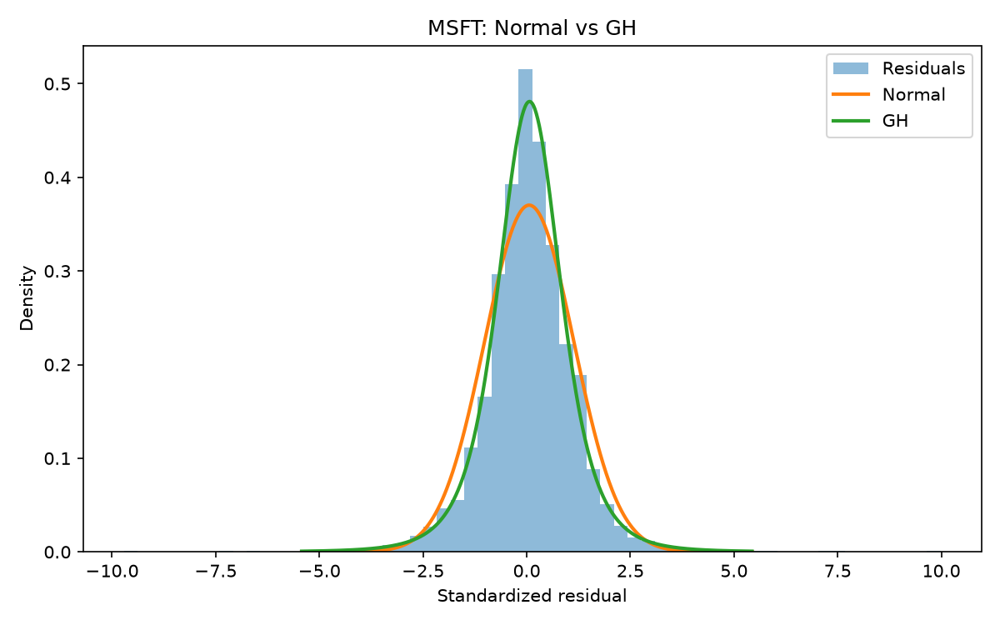

Этот репозиторий — переработанная версия учебного проекта, который я выполнял осенью в 2022 году в ЦМФ под руководством [Виталия Позднякова](https://github.com/vpozdnyakov).
Проект был посвящён методу Importance Sampling и моделированию редких событий: оценки 10-дневного 99% Value at Risk для доходностей и последующей проверки полученных моделей на исторических данных.
Основная цель проекта — сравнить обычный Monte Carlo и Importance Sampling при оценке хвостового квантиля и проверить насколько построенные VaR-модели соответствуют фактическому поведению доходностей.
В качестве примеров используются дневные доходности акций AAPL и MSFT за 2010–2025 годы.
## Что такое VaR
Value at Risk отвечает на вопрос: какой убыток портфель или актив с заданной вероятностью не должен превысить за фиксированный горизонт времени.
В проекте оценивается 10-дневный 99% VaR. Если `q_0.01` — 1%-квантиль распределения 10-дневной логарифмической доходности, то
\[
VaR_{99\%} = 1 - e^{q_{0.01}}.
\]
Например, VaR = 8% означает, что согласно модели только примерно в 1% 10-дневных периодов убыток должен превышать 8%.
**### Monte Carlo**
Monte Carlo позволяет оценить VaR через моделирование большого числа возможных сценариев будущей доходности. В каждом сценарии генерируются доходности следующих 10 торговых дней
\[
r_1^{(i)},\ldots,r_{10}^{(i)},
\]
после чего считается суммарная 10-дневная логарифмическая доходность
\[
R_{10}^{(i)}=\sum_{t=1}^{10}r_t^{(i)}.
\]
После большого числа повторений получаем выборку
\[
R_{10}^{(1)},\ldots,R_{10}^{(N)},
\]
которая приближает распределение возможной 10-дневной доходности. Для оценки 99% VaR полученные значения сортируются и берётся их 1%-квантиль.
Способ генерации дневной доходности зависит от выбранной модели. Например, в модели RiskMetrics + GH сначала рассчитывается текущая волатильность \(\sigma_t\), затем генерируется случайный стандартизованный shock \(\varepsilon_t\), после чего доходность определяется как
\[
r_t=\sigma_t\varepsilon_t.
\]
Проблема обычного Monte Carlo заключается в том, что для оценки 99% VaR нас интересует только небольшой левый хвост распределения. Большинство смоделированных сценариев находятся далеко от интересующего нас 1%-квантиля и почти не влияют на его оценку. Поэтому для устойчивой оценки хвостового квантиля может потребоваться большое число симуляций.
**### Importance Sampling**
Importance Sampling позволяет использовать то же число симуляций эффективнее. Вместо генерации сценариев непосредственно из исходного распределения \(f(x)\) используется proposal-распределение \(g(x)\), которое чаще генерирует значения в интересующей нас области левого хвоста.
Например, при оценке больших убытков можно сдвинуть распределение shocks в отрицательную сторону и увеличить его масштаб. Тогда среди тех же 100 000 симуляций будет значительно больше сценариев с сильным падением цены, то есть наблюдений, которые наиболее полезны для оценки 99% VaR.
При этом просто заменить исходное распределение на новое нельзя, поскольку тогда мы оценивали бы VaR уже для другой модели. Поэтому каждому сгенерированному значению присваивается likelihood-ratio вес
\[
w(x)=\frac{f(x)}{g(x)}.
\]
Этот вес компенсирует изменение распределения. Сценарии, которые proposal-распределение генерирует чаще исходного, получают меньший вес, а остальные — больший.
Для 10-дневной траектории общий вес равен произведению весов отдельных шагов:
\[
w^{(i)}=\prod_{t=1}^{10}\frac{f(\varepsilon_t^{(i)})}{g(\varepsilon_t^{(i)})}.
\]
После нормировки весов квантиль определяется по взвешенной выборке. Таким образом, Importance Sampling специально генерирует больше наблюдений в интересующем нас хвосте, но благодаря перевзвешиванию продолжает оценивать VaR исходной модели.
## Модели доходностей
В проекте сравниваются три способа моделирования будущих доходностей.
### 1. RiskMetrics + Generalized Hyperbolic distribution
Доходность представляется как
\[
r_t = \sigma_t \varepsilon_t,
\]
где динамическая волатильность оценивается по RiskMetrics:
\[
\sigma_t^2 = \lambda\sigma_{t-1}^2 + (1-\lambda)r_{t-1}^2,\qquad \lambda=0.94.
\]
После оценки волатильности строятся стандартизованные остатки
\[
\varepsilon_t=\frac{r_t}{\sigma_t}.
\]
Для их распределения используется Generalized Hyperbolic distribution.
### 2. RiskMetrics + эмпирические остатки
Динамика волатильности остаётся той же, однако вместо параметрического распределения будущие shocks выбираются непосредственно из исторической выборки стандартизованных остатков.
Таким образом, эта модель не требует предполагать конкретное семейство распределений для \(\varepsilon_t\).
### 3. Эмпирическое распределение доходностей
Наиболее простая модель: будущие дневные доходности напрямую пересэмплируются из исторической выборки.
Она не выделяет отдельно динамическую волатильность и поэтому служит полезным benchmark для двух моделей RiskMetrics.
Для каждой из трёх моделей VaR рассчитывается как обычным Monte Carlo, так и с использованием Importance Sampling.
## Почему используется Generalized Hyperbolic distribution
После стандартизации по RiskMetrics остатки всё ещё существенно отличаются от нормального распределения.
Для диагностики используются:
- гистограммы и Normal QQ-plots;
- excess kurtosis как мера тяжести хвостов;
- AIC для сравнения fitted Normal и Generalized Hyperbolic distributions.

Получены следующие значения:

| Актив | Excess kurtosis | Normal AIC | GH AIC |
|---|---:|---:|---:|
| AAPL | 5.16 | 11849.95 | 11326.47 |
| MSFT | 7.17 | 11930.57 | 11355.82 |

Большой положительный excess kurtosis показывает наличие тяжёлых хвостов. Более низкий AIC для GH означает, что дополнительная гибкость распределения существенно улучшает качество описания данных даже с учётом большего числа параметров.
### AAPL

### MSFT

## Реализация Importance Sampling
Для разных моделей используются разные способы изменения распределения симуляции.
### GH-модель
Для Generalized Hyperbolic proposal одновременно используются:
- сдвиг распределения в сторону отрицательного хвоста;
- увеличение масштаба распределения.

Параметры proposal подбирались в пилотных экспериментах по RMSE оценки VaR.
### Эмпирические распределения
Для исторических residuals и доходностей используется weighted sampling: отрицательные наблюдения получают повышенную вероятность попадания в выборку.
После этого результат корректируется likelihood-ratio весами.
### Сглаживание
Для GH Importance Sampling дополнительно используется сглаженная оценка weighted CDF. Вместо скачкообразной эмпирической функции распределения используется
\[
\widehat F_h(x)=\sum_i w_i\Phi\left(\frac{x-X_i}{h}\right).
\]
Квантиль определяется из уравнения
\[
\widehat F_h(q)=0.01.
\]
## Как оценивалась численная эффективность
Для сравнения методов использовались несколько показателей.
**RMSE** показывает среднеквадратичное отклонение оценённого VaR от reference-значения, полученного большим Monte Carlo.
**Bias** показывает систематическое смещение оценки.
**Standard deviation** показывает, насколько сильно результат меняется от одного Monte Carlo запуска к другому.
**Effective Sample Size (ESS)** характеризует качество IS-весов:
\[
ESS=\frac{1}{\sum_i w_i^2}.
\]
Если несколько сценариев получают почти весь суммарный вес, ESS становится маленьким. Поэтому увеличение концентрации симуляций в хвосте имеет смысл только до тех пор, пока деградация весов не начинает перевешивать выигрыш Importance Sampling.
Параметры proposal выбирались по RMSE с дополнительным контролем ESS.
## Текущие оценки 10-дневного 99% VaR
Для 100 000 симуляций:

| Актив | Модель | Monte Carlo | Importance Sampling |
|---|---|---:|---:|
| AAPL | RiskMetrics + GH | 6.39% | 6.33% |
| AAPL | RiskMetrics + остатки | 6.22% | 6.25% |
| AAPL | Эмпирические доходности | 12.18% | 12.22% |
| MSFT | RiskMetrics + GH | 8.04% | 8.10% |
| MSFT | RiskMetrics + остатки | 8.10% | 8.12% |
| MSFT | Эмпирические доходности | 11.27% | 11.16% |

Близость MC и IS оценок ожидаема: оба метода оценивают один и тот же квантиль. Выигрыш Importance Sampling проявляется прежде всего в меньшей дисперсии оценки при фиксированном числе симуляций.
## Backtesting
Численная точность Monte Carlo ещё не означает, что сама модель риска хорошо описывает реальные данные. Поэтому отдельно проводится исторический backtesting.
На каждой тестовой дате:
1. используются только предыдущие 1000 торговых дней;
2. рассчитывается 10-дневный 99% VaR;
3. наблюдается фактическая доходность следующих 10 дней;
4. фиксируется VaR breach, если фактический убыток оказывается больше прогнозируемого VaR.

Используются неперекрывающиеся 10-дневные интервалы. Для каждого актива получено 302 прогноза.
При корректном 99% VaR ожидаемое число breaches составляет
\[
302 \times 0.01 = 3.02.
\]

| Актив | Модель | MC breaches | IS breaches |
|---|---|---:|---:|
| AAPL | RiskMetrics + GH | 4 | 4 |
| AAPL | RiskMetrics + остатки | 4 | 4 |
| AAPL | Эмпирические доходности | 3 | 3 |
| MSFT | RiskMetrics + GH | 3 | 3 |
| MSFT | RiskMetrics + остатки | 2 | 2 |
| MSFT | Эмпирические доходности | 3 | 3 |

## Статистические тесты backtesting
Для проверки результатов используются два стандартных теста.
### Kupiec test
Проверяет unconditional coverage: соответствует ли общая частота VaR breaches заявленной вероятности 1%.
Во всех шести вариантах модели для обоих активов гипотеза о корректном покрытии не отвергается на уровне значимости 5%.
### Christoffersen test
Проверяет независимость превышений во времени.
Даже если общее число breaches правильное, модель может быть неудовлетворительной, если нарушения группируются во время кризисных периодов.
Для большинства моделей гипотеза независимости не отвергается. Исключением является эмпирическая модель для MSFT: три превышения дают правильное unconditional coverage, однако два из них происходят последовательно, из-за чего Christoffersen test указывает на кластеризацию (`p ≈ 0.016`).
## Структура проекта
```text
market-risk-var/
├── src/
│   ├── data.py
│   ├── riskmetrics.py
│   ├── diagnostics.py
│   ├── distributions.py
│   ├── estimators.py
│   ├── var_models.py
│   └── backtesting.py
├── figures/
├── results/
├── requirements.txt
└── README.md
